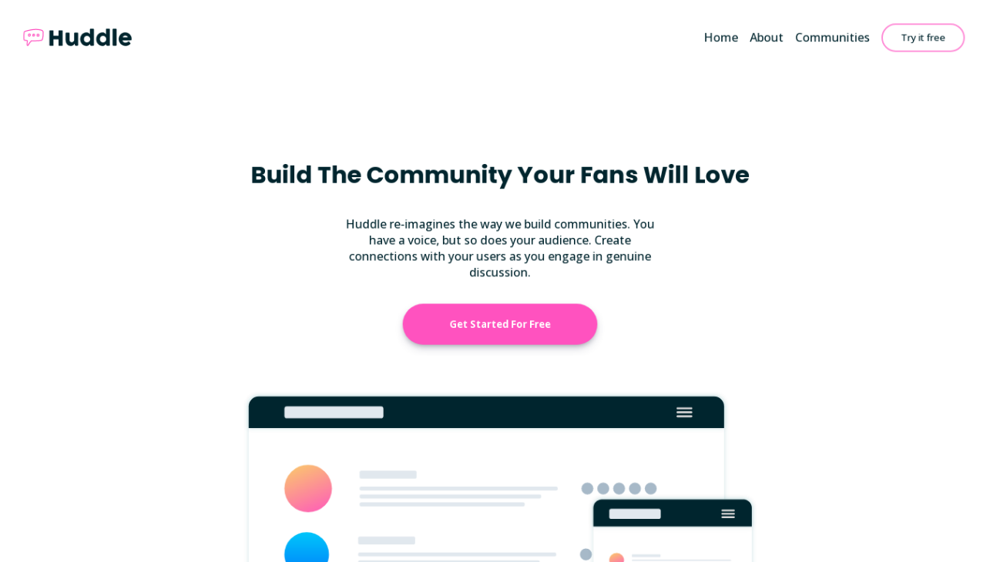

# Frontend Mentor - Huddle landing page with curved sections solution

This is a solution to the [Huddle landing page with curved sections challenge on Frontend Mentor](https://www.frontendmentor.io/challenges/huddle-landing-page-with-curved-sections-5ca5ecd01e82137ec91a50f2). Frontend Mentor challenges help you improve your coding skills by building realistic projects. 

## Table of contents

- [Overview](#overview)
  - [The challenge](#the-challenge)
  - [Screenshot](#screenshot)
  - [Links](#links)
- [My process](#my-process)
  - [Built with](#built-with)
  - [What I learned](#what-i-learned)
  - [Continued development](#continued-development)
- [Author](#author)

## Overview

### The challenge

Users should be able to:

- View the optimal layout for the site depending on their device's screen size
- See hover states for all interactive elements on the page

### Screenshot

### Links

- Solution URL: [https://github.com/davidudo/huddle-website-01](https://github.com/davidudo/huddle-website-01")
- Live Site URL: [https://davidudo.github.io/huddle-website-01](https://davidudo.github.io/huddle-website-01/)

## My process

### Built with

- Semantic HTML5 markup
- CSS custom properties
- Flexbox
- Mobile-first workflow

### What I learned

I learned the importance of creating an interactive website. I understood that users need to be able to feel your website while navigating it.

### Continued development

I will love to learn CSS animations in order to build highly interactive websites.

## Author

- Frontend Mentor - [@davidudo](https://www.frontendmentor.io/profile/davidudo)
- Twitter - [@_davidudo](https://www.twitter.com/_davidudo)
